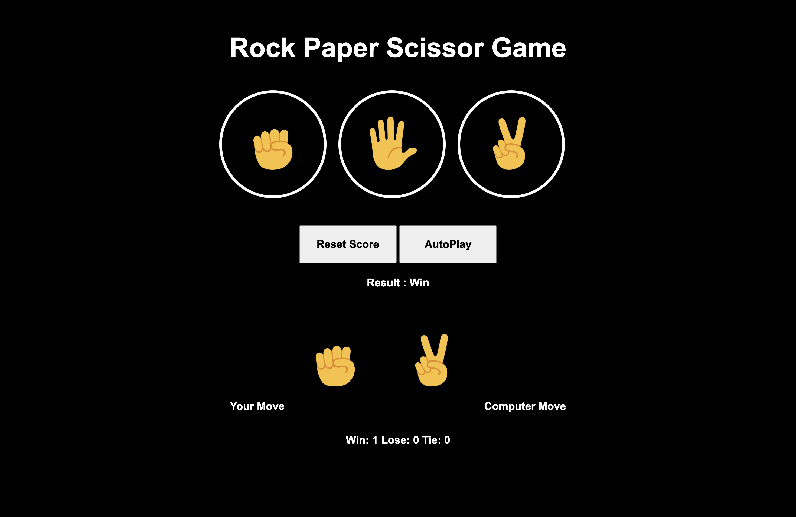
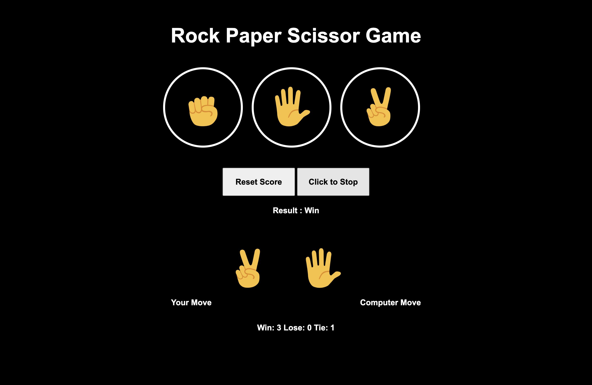

# Rock Paper Scissors Game


An interactive **Rock–Paper–Scissors game** built using **HTML, CSS, and Vanilla JavaScript**.  
The application allows users to play against a computer opponent, track scores, enable autoplay mode, and persist results using **Browser LocalStorage** so that the score remains available even after refreshing or reopening the browser.

---

## Live Demo

[View Live Demo](https://mabhishek-dev.github.io/rock-paper-scissors-game/)

---

## Tech Stack

- **HTML5**
- **CSS3**
- **JavaScript (Vanilla JS)**
- **Browser LocalStorage**

---

## Features

- Play **Rock–Paper–Scissors** against the computer  
- Computer generates random moves  
- Displays game results (**Win / Loss / Tie**)  
- Tracks total **Wins, Losses, and Ties**  
- **Reset score** functionality  
- **Autoplay mode** where the game plays automatically  
- Score persistence using **Browser LocalStorage**

---

## Purpose

This project was built to strengthen **JavaScript fundamentals** through interactive game development and dynamic UI updates.

Key concepts practiced include:

- Handling user interactions with JavaScript  
- Generating random computer moves  
- Dynamically updating the DOM  
- Managing game logic and score tracking  
- Persisting data using **Browser LocalStorage**

---

## Project Structure

```
rock-paper-scissors-game/
│
├── index.html
│
├── script/
│   ├── autoplay.js
│   ├── play.js
│   └── reset.js
│
├── styles/
│   ├── common.css
│   ├── game-buttons.css
│   ├── game-controls.css
│   └── render-result.css
│
├── emoji/
│   └── ...
│
└── screenshots/
    ├── demo-manual.png
    └── demo-auto-play.png
```

---

## Setup Instructions

Clone the repository:

```bash
git clone https://github.com/mabhishek-dev/rock-paper-scissors-game.git
cd rock-paper-scissors-game
```

Then open:

```
index.html
```

in your browser.

No dependencies or build tools are required.

---

## Screenshots

### Manual Play


### Autoplay Mode


---

## License

This project is licensed under the **MIT License**.
